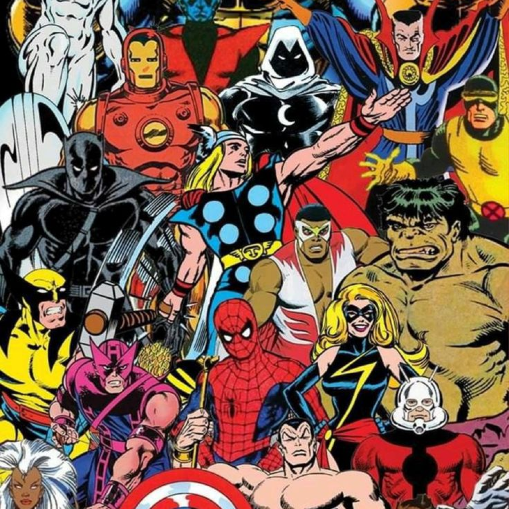
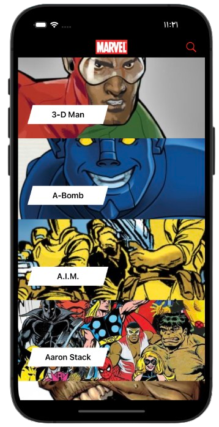
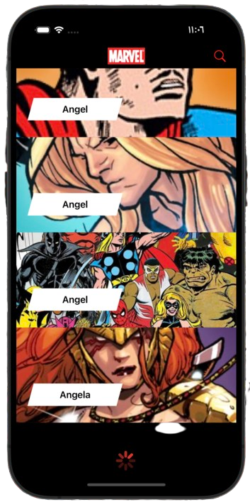

<table>
  <tr>
    <td></td>
    <td><h1>Marvel</h1></td>
  </tr>
</table>

Marvel Characters is an iOS application that allows users to explore information about various Marvel characters, including details about their comics, series, stories, and events.

## Features

- **Browse Marvel Characters:** Explore a comprehensive list of Marvel characters.
- **Character Details:** View detailed information about each character, including name, description, and images.
- **Explore Related Content:** Navigate through comics, series, stories, and events associated with each character.
- **Smooth Navigation:** Seamless transition between different sections for an enhanced user experience.
- **Search Functionality:** Easily search for a specific Marvel character by name.

## UI

### Characters list

  
  

## Implementation Highlights

### MVVM Architecture

Marvel Characters is built using the Model-View-ViewModel (MVVM) architectural pattern. This approach ensures separation of concerns.

### RxSwift Integration

The project leverages RxSwift for reactive programming. This enables the use of Observables and Subjects for handling asynchronous operations, such as fetching data and updating the UI reactively.

### Pagination for Character List

To optimize the loading of Marvel characters, the app implements pagination. This approach loads characters in batches, improving performance and providing a smoother user experience. As the user scrolls, additional characters are fetched dynamically.

